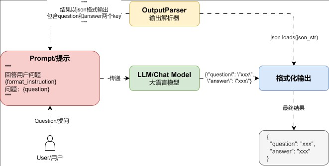

# Prompt
大多数 LLM 应用程序都不会直接将用户输入传递给 LLM ， 通常它们会将用户输入添加到一个更大的文本片段中，称为**提示模板**



## Prompt基本组成
Prompt 分为两大类
* Prompt Template：将 Prompt 按照 template 进行一定格式化，针对 Prompt 进行变量处理以及提示词的组合。
* Selectors：根据不同条件去选择不同提示词，或者在不同情况下通过 Selector，选择不同示例去进一步提高 Prompt 支持能力。(本质上 Selectors 只是 Prompt Template 的二次封装)


不同 Prompt 组件功能的简介：
* `PromptTemplate`：用于创建文本消息提示模板，用于用于与大语言模型/文本生成模型进行交互。
* `ChatPromptTemplate`：用于创建聊天消息提示模板，一般用于与聊天模型进行交互。
* `MessagePlaceholder`：消息占位符，在聊天模型中对不确定是否需要的消息进行占位。
* `SystemMessagePromptTemplate`：用于创建系统消息提示模板，角色为系统。
* `HumanMessagePromptTemplate`：用于创建人类消息提示模板，角色为人类。
* `AIMessagePromptTemplate`：用于创建AI消息提示模板，角色为AI。
* `PipelinePromptTemplate`：用于创建管道消息，管道消息可以将提示模板作为变量进行快速复用。

Prompt 不同方法的功能简介：

* partial：用于格式化提示模板中的部分变量。
* format：传递变量数据，格式化提示模板为文本消息。
* invoke：传递变量数据，格式化提示模板为提示。
* to_string：将提示/消息提示列表转换成字符串。
* to_messages：用于将提示转换成消息列表。

## 基础用法
```py
from langchain_core.prompts import PromptTemplate

prompt_template = PromptTemplate.from_template("将一个关于{topic}的笑话")

prompt_template.invoke({"topic": "程序员"})
# text='将一个关于程序员的笑话'
```